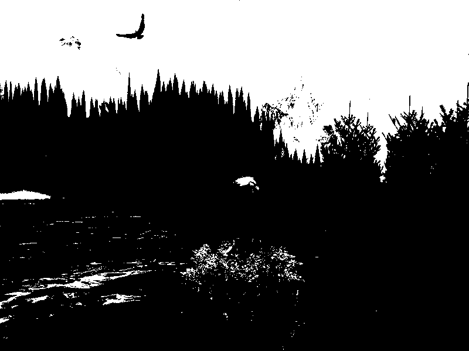
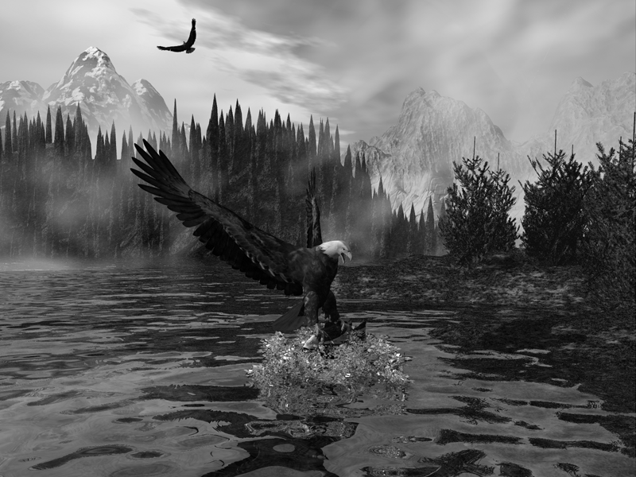
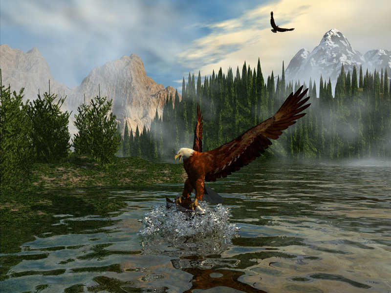
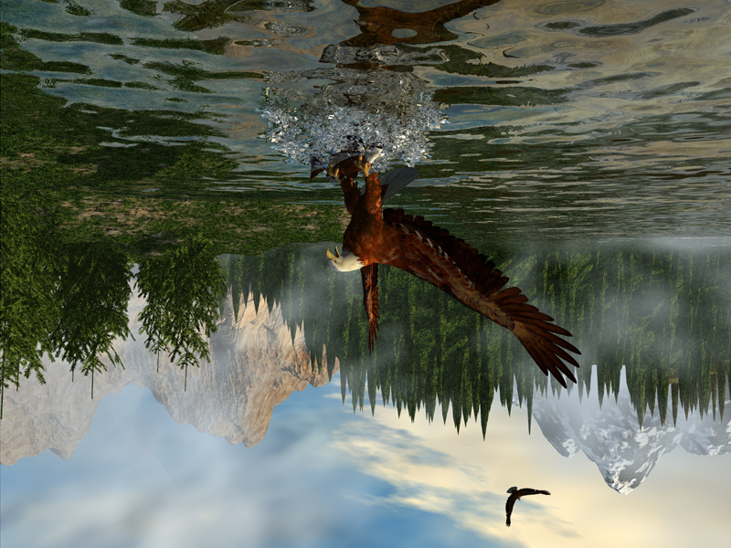
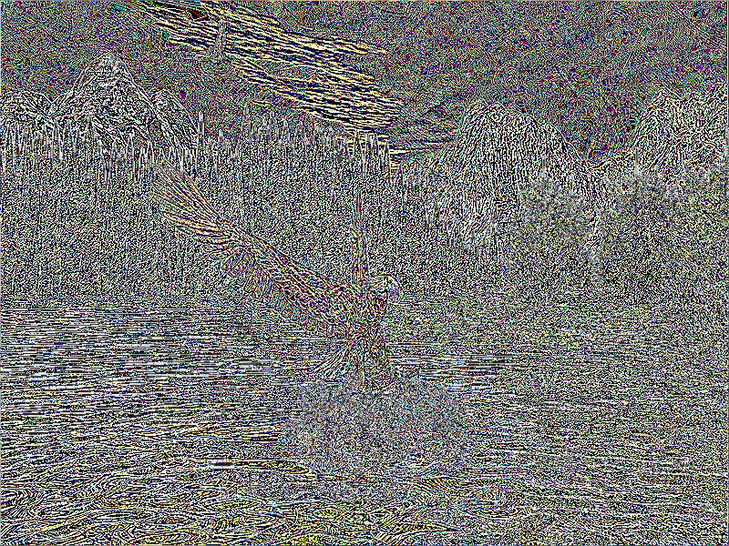
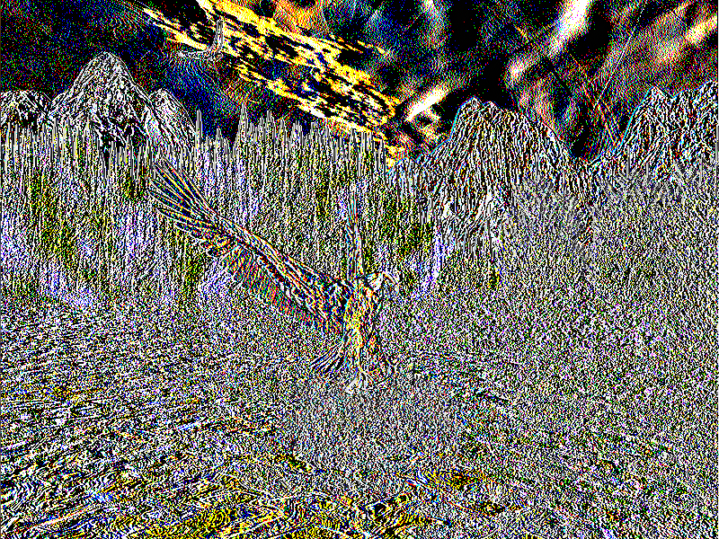
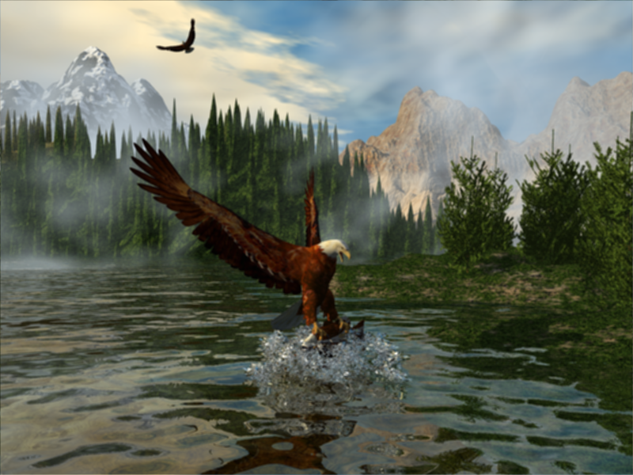
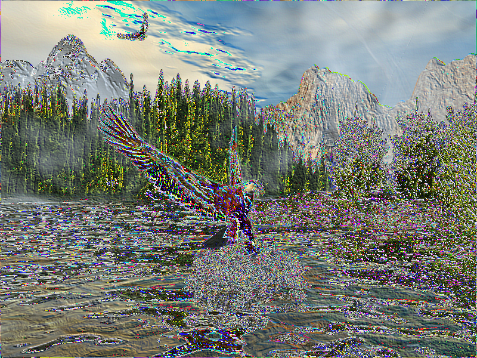
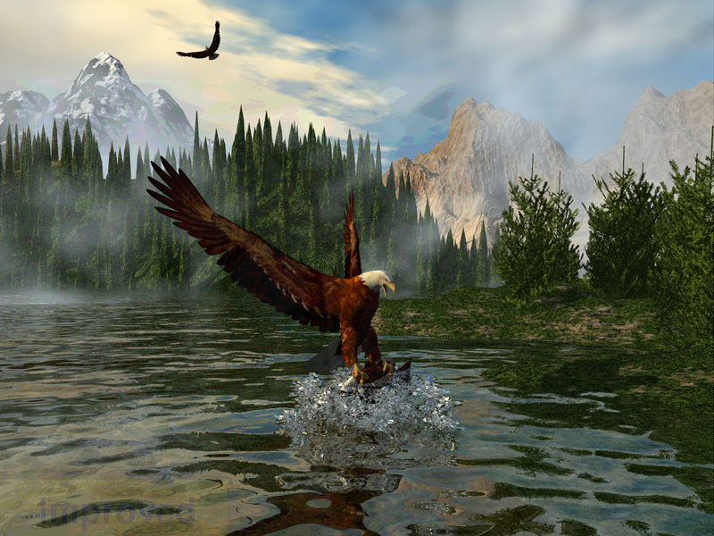
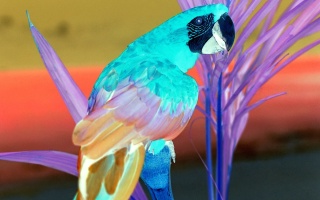

# Traitement-images

*Image processing*

**Date de réalisation :** Avril 2019

**Cadre du projet :** Cours "Problème scientifique informatique" en 2ème année de prépa intégrée à l'ESILV

**Langage utilisé :** C#

## Présentation du projet

Il s’agit d’un projet informatique réalisé en C# sur le sujet du traitement d’images, au format Bitmap 24 bits.
J’ai créé un outil permettant de lire une image, de la traiter et de la sauvegarder dans un fichier de sortie différent de celui donné en entrée.

Les différentes fonctions disponibles permettent de :

-	traiter une image : passage d’une photo couleur à une photo en nuances de gris et en noir et blanc, agrandir/rétrécir une image, rotation (90, 180 ou 270°), effet miroir

<p align="center">
  
  
  
  
</p>

-	appliquer un filtre (à l’aide d’une matrice de convolution) : détection de contour, renforcement des bords, flou, repoussage

<p align="center">
  
  
  
  
</p>

-	créer une nouvelle image : fractale, histogramme se rapportant à l’image

<p align="center">
  
</p>

-	coder et décoder une image dans une image

<p align="center">
   <b>+</b>
   <b>=</b>
  
</p>

-	inverser les couleurs de l’image

<p align="center">
  
  
</p>


## Structure des fichiers

Le projet comporte 3 classes : MyImage, Pixel et Program.

Les images à utiliser pour le projet doivent être placées dans le dossier ./bin/Debug.

Si le projet Visual Studio se nomme Traitement_images, il suit donc cette structure :

```dir
│___Traitement_images
│       bin
│          Debug
│             coco.bmp
│             ImprovedLogo.bmp
│             lac_en_montagne.bmp
│             ...
│          Release
│       obj
│       Properties
│       App.config
│       MyImage.cs
│       Pixel.cs
│       Program.cs
│       Traitement_images.csproj
│
└───Traitement_images.sln
```
